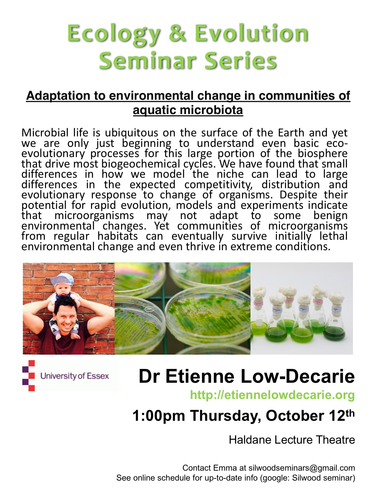

 

####Predict how microbes will react based on niche

Thermal niche and competition

- ???

Thermal niche and biogeography

- 3 speciea of lizards...
- lab experiment to see what they prefer?
	- matches where they live in the wild..

Thermal biogeography of pythoplankton

Measuring and modelling the fundermental niche
 
 - they have developed a number of equations to describe the response to a
    range of different thermal conditions (12 models)
    - lots of varitation in min, optimal and max conditions
    - no one model fits better under particular circumstances...
    - models give differences in preditions

Model and data quality
- Example: equation 6 vs equation 15
	- Both match pretty well but...
	- when you look at the differences between them, there is quite a big difference

- Evolution: selection pressure (first derivative) is model dependant
- Some models/species have derivatives approaching 1 - very wide niche and so less sensitive - some in the other direction...

####Rapid adaption
- you can see it in the lab!!
	- easily over the course of a phd
	
- Algae and CO2
 	- Evolutionary response to elevated to CO2 unlikely in freshwater algae

- No temperature adaption?
	- phytoplankton grown at 15C and 20C for 5 years -no adaption!!
    - possibly not enough of a selection pressure

- Adaption to lethal conditions
    - Adaption of whole communities
    - Local adaption vs adaption to conditions far outside the range experienced by the ecosystem

- Evolutionary rescue
	- rare-type that is adapted
    	- allele spreads quickly through the population
	- Recue at higher levels...?
 	- communities acrosee a gradient of herbicide and carbon...

####Summary of experiment!!
    
Communities can
- be rescured from environmental degredation
- expand their range to initial lethal conditons
    
- Community rescue more probable

Large diversity of rare types

Lots of diversity at one location...

- rarity has something to do with mal-adaption....
    - locally out competed
    - adapted for very different conditions

Extreme environments as model systems

Can you find extremeophiles in benign environments

####Amplifying bioreactor...
- selective agent
- nutrients
- inflow of new organisms

- only those which could survive grew...

- benign, acid, base and salt environments...
- organisms whilch could cope with the stressor were also ok in benign too
	- maybe all the stressors require similar tools (abiltiy to pump ions)

generalising across ecosystems

- connected marine and freshwater sites (rivers!!)

generalising across stressors

Looked at the abundance of highly resistant organisms

CONCLUSIONS

Greater measurements of the niche for model selection