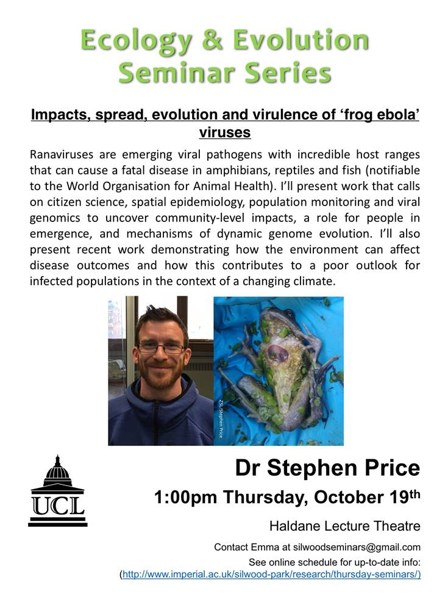

 

###Frog ebola is bad!

- Systemic haemorrhaging

###Ranavirus

- large Nucleocytoplasmic DNA viruses
- Iridoviridae family!
- Life cycle
 	- two rounds of replication
 
###why are they important pathogens

- fatal disease (1)
	- Severe impacts: Iberia
		- monitoring 3 species: Where ranavirus is present there is a precipotous drop in populations
	- Similar in portugal: Serra de Estrela
- Impacts on host populations! (2)
	- Declines in common frogs in SE England
	- 80% decline in English common frog populations for ponds where ranovirus is present!!
	- Difference! -some degree of host specialisation
- Emerging pathogens (3)
	- Pathogens translocated by humans
		- Amphibian commerce 
		- Salamanders used as fishing bate in North America
		- Frog and salamander farms in china
		- Imports…
	    
	    
	    
###The Frog Mortality Porject

- Citizen science project → large dataset! (started in 192)
	- ~5000 records of mortality in amphibians
	- Dead animals
	- General garden/pond management
- Emerging pathogens translocated | Humans
- Is what they are seeing real or is it a result of increased effort
- He wanted to model 2 things...
	- Warnings against moving frogspawn… → does it have anything to do with the pattern of spread
	- seasonal effects
	- FIND THE PAPER (price et al 2016. Porc soc B 283:20160952
	- the model seems to work

- something about London being different cause of its built up nature: used Free school meals to look ap pop density…
	- Host range (4)
		- all life histories
		- across the whole diversity of amphibia but also fish and reptiles!

###Evolutionary perspective

- Variation amoung isolates
- the viruses origonated in fish and jumped to amphibians
	- Genetic determinants?
		- Contrasting phenotypes between ranovirus genotypes
		- Variation at genome level
			- Lots!!
			- very dynamic genomes!
			- Horizontal transfer from hosts 
				- US22 protiens
				- Gene family with possible diverging functions
				- horizontally aquired from hosts on multiple occasions
			- Manipulating geneomes
				- Gene knockout…
			- sequencing!
				- Big project starting!…

###GxGxE in a bottle – a model system for host-virus interarctions
- two lineages, looking at effect og temperature
 	- one likes heat the other doesnt!!
 	- similar across different hosts
- Validating the culture model in vivo (temperature controlled boxes…
	- 6 treatments, 2 temperatures (21 and 27) and 3 viruses
		- 10 animals per tratment
	- measured survival and viral load…
	- Strong effect of being affected!
		- But also strong effect of temperature
		-  Predictions from lab work
		- More incidents when its hot!
		- More severe mortality incidents when its hot
- Is it real!!!
	- Filter for likely ranavirus events
	- Expecting bi-modal data → due to human activity…
	- Ise estimates of dead and remaining healthy population size to generate