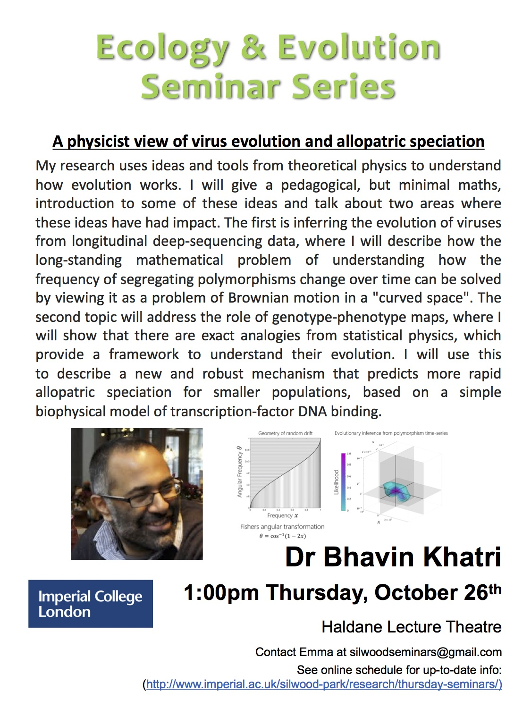

 

A physics view of allopatric speciation

    • What is physics?
        ◦ Science of matter, motion and force
        ◦ how doe it relate to evolution?
            ▪ Population growth
            ▪ mutation etc
            ▪ matmatics based on abstractions
            ▪ abstract maths has many applications in physics
            ▪ evolutionary forces!!!!
    • Deep sequencing longitudinal data
    • 3 basic evolutionary forces
        ◦ Selection
        ◦ Mutation
        ◦ Random Drift
            ▪ when population sizes are small (effective population size (N))
    • Neutral muatation (Nu) (N times mu)
        ◦ Nu steadily decreased
        ◦ In large population, a mutation with no advantage you would expect the frequency to go to ½
            ▪ not the case in small populations
    • Substitution vs mutation rate
        ◦ Mutations arise at the same rate (no matter whther neutral, advantageous or deleterious)
        ◦ substiution rate does depend on the benefit of the allele
    • phylogenetic vs genealogical trees (cool figure!!!) Rambaut, Nature rev. Gen. 2004
    • Random drift or selection!!
        ◦ simulations → its difficult to tell which is which!
        ◦ Probabilty of observed changes in frequency…
            ▪ mathmatical models!!
        ◦ simple random walk
            ▪ the width of distribution increases over time!! (theres an equation!)
        ◦ Random drift 
            ▪ Wright-Fisher model
                • N members of a pop
                • a bit like random walk between two pubs!!
                    ◦ moves slower the closer to the pubs he gets!
            ▪ Random drift is an emergent force!
                • Like gravity
                    ◦ flat space perterbed by a massize object
        ◦ Fishers angular transformation
            ▪ simple random walk but on a hill!
            ▪ Selection and mutation distort this hill
                • strong mutation into a vally
                • selection bigger hill??
    • He came up with a solutoion!!!
        ◦ Heuristic Gaussian soluiton
        ◦ cool simulations!!
        ◦ goodness of fit to simulated data – estimates are pretty good!
    • Summary!
        ◦ ????

    • Biophysical genotype maps
        ◦ evolutionary dynamics 
        ◦ genotype phenotype maps
        ◦ qgenotype-mutaion
        ◦ phenptype-selection
        ◦ simple medel of TF-DNA binding
        ◦ Monte Carlo simulations of these…
    • model of allopatric speciation!!
        ◦ good slide!!
            ▪ starts off with one ste of DNA, splits population and mesures compatability over time…
            ▪ smaller populations take less time
        ◦ populatiion size dependance of speciation rate
        ◦ speciation by small founder populations
    • Summary
        ◦ selection acts on phenotype but variation comes from mutations
        ◦ simple biophysical model of protien DNA binding show sequnce…..