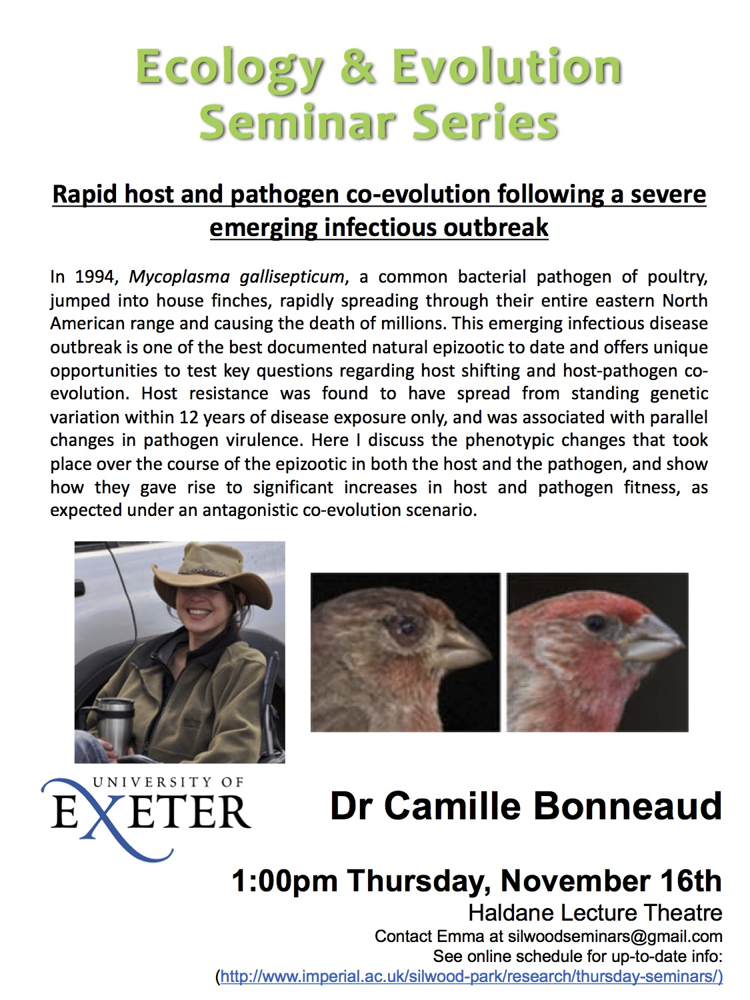

 

Rapid host-pathogen coevoluiton following an imerging infection outbreak

case of rapid coevoulution in your own back yard – house finches!!

classic example – myxomatosis in rabbits (Australia)
    • Repeated introduction of highly virulent strain of myxomotosis
    • massisve decline in population
    • this decline slowed after just a few years

Host shift in natural population
    • Mycoplasma gallisepticum – house finch
        ◦ causes very sever conjunctivitus
    • well documented emerging disease outbreak
        ◦ citizen servalance neteork
        ◦ know origin
        ◦ detailed knowlegde of spread
        ◦ high host mortality
        ◦ some house finch populations remain unexposed!

Outline
    • Host shift – changes in pathogen
    • Parallell changes 
    • Evidence for coevolution

Host shift
    • whole genome sequencing of various Mg isolates 
    • Phylogenetic evidence for a single host switch
    • contact was not limiting factor in host shift
        ◦ experimentaly exposed finches to chicken strain and house finch strain (isolate)
        ◦ less infection success with chicken isolates
        ◦ contact with novel host was not enough!!!!
    • Changes in bacteria/host cell interactions
        ◦ Eperimental infection of avan cell cultures
        ◦ Chicken embryonic fibroblasts…
    • Outbreak strain is highly adhesive and invasive
    • outbreak strain shows high levels of persitance and exit from host cells
        ◦ intracellular survival, replication within and subsequent exit from host cells
        ◦ dissemination across mucosal barrier, establish infection, give rise to systemic infection
    • outbreak strain is not cytotoxic
        ◦ the house finch epipenic actually increases cell survival (prevents background cell death!!)
    • 1. Genome wide changes in pathogen	
    • 2. Exposure was not sufficient
    • 3. House finch outbreak is more adhesive/invasive/persistanr and increased cell survival!

Host resistance and pathogen virulence
    • Experimental test of the spread of host resistance
        ◦ Have historically infected birds developed resistance?
            ▪ Gave an isoluate to exposed an non-exposed populations
    • Difference in resistance: bacterial load
    • Difference in resistance: splenic gene expression (gene expression in the spleen)
        ◦ Go back over slide!!!!
    • Chnages over time in histroically-exposed population
        ◦ qualitative difference infected vs control in exposed population
        ◦ resistance has spread within 12 years of outbreak…
    • Differences in pathogen virulaence
        ◦ virulence increases….
    • Evolution of increased pathogen virulence
        ◦ 56 isolates sampled over 20 years
    • Phenotypic chnages in host and pathogen
        ◦ Rapis spread…
        ◦ .,….

Co-evolution?
    • Evidence for host pathogen co-evoluiton
        ◦ reciprocal phenotypic changes associarted with changes in fitness
        ◦ experimental evolutrion…
    • Testing for co-evolution between house finches and mycoplasm
        ◦ not possible to freeze vertabrate hosts!!!!
        ◦ but we do have hosts at different time stages (depending on what point they were exposed!)
        ◦ 56 isolates inoculated on exposed and non-exposed populations
    • probaility that pathogens gained fitness increased  over time
        ◦ yes
    • hosts from exposed populations have higher fitness 
        ◦ based on host mortaility (associated blindness and starvation…)
    • who has the upper hand?
    • Vertabrate host drives the coevolutionary race

Conclusions!
    • Host shift – changes in the pathogen needed to jump to house finches
    • parallel increases….
    • …...