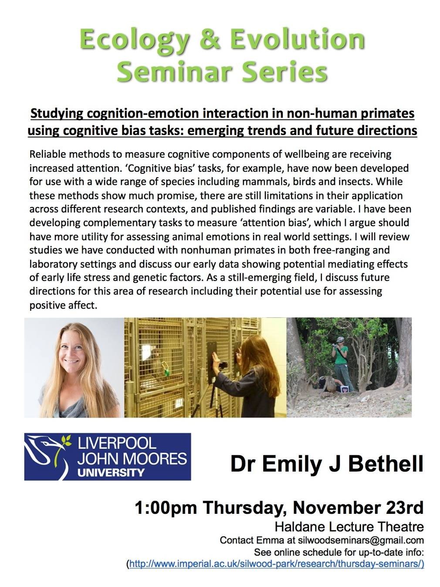

__Studying cognition-emotion interaction in non-human primates__

__Overview__

- cognitive theories of emotions in humans
    - theory
    - methods
- cognitive bias studies to data
    - attention bias
    - Emerging trent
- future work

__cognitive theories of emotion__

- cognition = processing info in the brain (includes perception…)
- emotion = response to stimulus

__2 routes of info processing in the brain__

- high road cognative response
- low road emotional response

__Cognitive theories of emotion in humans__

- Feedback loop of emotional disorder
- The spiral of depression
    - if you are in a poor emotionl state then you process stimuli more negatively → feedback loop
    - interaction between emotion and cognition is well established
- Anxious people
    - Negative judgements about about ambiguous info
- Electrophysiology - on humans. Time course of attentional response varies with emotion.
- Negative attention bias in anxiety across populations
    - anxious people focus more on the negative (threatning) stimuli
    - eye tracking - people who are anxious are slower to name ‘negative words’ colour (weired experiment)
    - Visual search – anxious people are faster to detect negative stimuli
    - These emotional responses and vital for survival – animals definatley have them!!!!
- enhanced freezing response! - children freeze for up to 50s when a stranger enters the room!
- Suggested genetic compnant
- Lessons from human studies	
    - reproted feeling relate to objective cognitive measures
    - general bias for theat/negative anxiety
    - different biases distinguish different emotiosn?
    - Negative attention bias
    - Risk factor

__Can we  adapt these methods for other mamalian species? Monkeys!__

- Do monkeys exhibit cognition – emotion interactions like huamns do?
    - Wjich can therefore be measured objectivley?
    - Providing a new approach….
- Attention bias
    - similar to the human thing…
    - not sure how much I trust it…
    - anxious monkeys have an avoident attention bias… (opposite of human study)
        - after being stressed the mokeys avoid the threatning face!
        - Clear signal backed up by further studies
    - huge variability before vet check (stressor) less aso after the stress.
- Current work (attention bias)
    - 67 females (mmm feeling a bit awkward about this…)
    - some DNA stuff
    - early maternal seperation = early life stress
    - Annual health check = repeated measure
    - Behavioural coping….

- Summary Att Bias!
    - Growing evidence base for cognition-emotion interaction…
    - Probably a good slide for summary!!

Coping style?
    - Agrressive coping style

__Finding to date -> another good summary slide…__

__The Macaque website nc3rs.org.uk/macaques__
