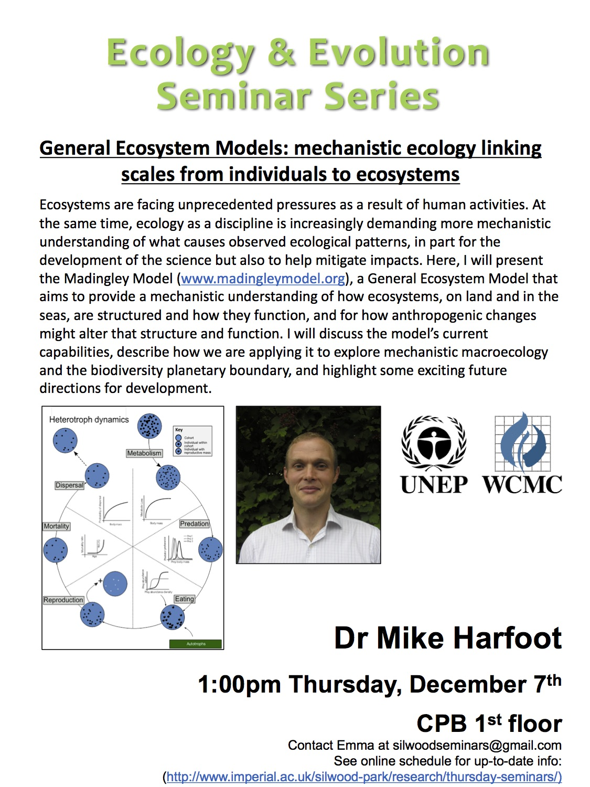

 

Mike Harfoot
General Ecosystem models: mechanistically linking scales from individuals to ecosystems

__Biodiversity is complex!!! and fundemental for a habitable planet__

- because of the complexity most conservation is based on phenolomigical models
	- cant upick causation
	- issues in transfering these models to other systems…

__The climate system is also complex!__

- Bt mechanistic models have been being developd fro ~60 yrs
- the required data has been gathered…

__In ecology we are in the 1950s (relative to climate models)__

- it started as a gross simplification!!

__The Madingley Model!__

- Balanced osnsideration of all trophic levels
- properties emerge
- open
- reproducible
- inspirational

__PLOS (Emergent Global patterns of ecosystem structure and function)__
   
- model has realistic geogrpahy (continents etc.)
- ocean circulation
- environmental conditions
- temp
- precipitation
- marine
- can nbe run at different spatial scales but computationally difficult

- the aim is to run the model at the level of the individual 
    - not based on taxonomy though (dont really care about specific species)
    - individuals are instead defined by functional traits…
    - grouped into cohorts… (individuals with the same traits), with an abundance.

- Ecologcal process is the models (one timestep on a cohort)
    - Metabolism
    - predation
    - eating
    - reproduction
    - mortality
    - dispersal

- Emergent structure
    - what emerges is braodly realistic at local scales.., (though it is increadibly simplistic compared with the real world)
- looking at trophic structure (model vs empirical data)
    - for some locations the model does ‘OK’
        - on log scale so diffreences are large!
    - In other places it does a really bad job!!
        - the model is ignoring a whole load of ecology which is probably important!

__Mechanistic Macroecology!__

Applying mechanistic models to macroecology
(Process, Mechanism and modelling in macroecology)

__Mechanistic simulation models in macroecology and biogeography: state-of-art and prospects__
- state of system explicitly as a function of componant parts
- richer inference of causation
- if-then excercises on virtual worlds…
- reciprocally macroecological patterns valuable for evaluation

Bergmanns Rule (across latitudes we see changes in body-mass of individuals)

- (Rapacciuolo, 2017, Global Ecology and Biogeography)
- is it
    - chance
    - migration ability
    - thermoregulation
    - etc…
- model vs empirical isnt too bad…
- environemntal manipulations…
    - different things… (NPP, T)
    - can do call things like run model with no endos or no ectos or both but no interaction…
        - changes the effects…
        - sueggest the result of the full model is due to trophicinteractions…

__Responses to Global Changes__
- Madingly twith PEDICTS!
- Madingly has a much greater range but the median results are similar (encouraging)
- Ecosystem response types	
  ◦ dynamics of a system under purtibation…
  ◦ different ecosystems have qualitativley different responses…
- __THIS IS REALLY INTERESTING!__
- How is it different if the patterning of the pururbations is different (not uniform as above)
  ◦ again different responses!
- Larger organisms in general respond faster… (disserpering from the landscape faster)

__Esploring the biodiversity planetary boundary__

- how far can we go before the planet is fucked?

__Lots of reasons why the model is a good thing (even though its nowhere near perfect!!)__

__Would be cool if the model could be put in with bayesian inference – where do we need more data, where is the uncertainty?__
