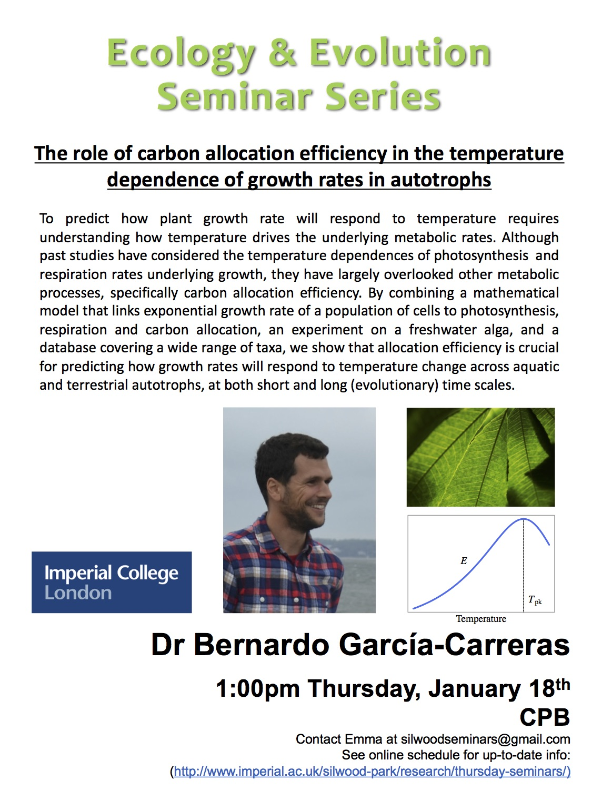

 

# The role of carbon allocation efficiency in the temperature dependance of growth rate in autotrophs
__Bernardo Garcia-Carreras (from Silwood! - moving to florida in March)__

__intro__

- autotrophs respond to temperature!
- Need mechanistic understanding of growth (TPCs)
- metabolic rates → photosynthesis  and respiration
- what about efficiency!!!!
- population model
    - fit it to data from lab experiment on pytoplankton
    - Explore

__The Model__
    
- 1/N * dN/dt = r = eF
    - N = autotroph biomass growth rate
    - r = growth rate
    - F = carbon flux
    - e (epsilon) = efficientcy
- photosythesis P & respiration R
    - schoolfield equation
    - E – activation energy – the relative increase in rate with temperature
- allocation of efficiency

__The Experiment__
    
- Chlorella vulgaris
- isolation from pond in N England – kept at 20C
- Growth, P and R for two sets of populations
    - Acclimated ~ 10 generations
    - Adapted ~ 100 generations
- Over the course of adaptation both P and R decline – at both temperatures
    - adapted populations have a much lower growth rate than acclimated…
    - Weired!?
- Below ~30C both populations seem to grow at the same rate – adapted pops do better at higher temps…
- efficiency is temp dependance and adapted individuals grow more efficiently!
- Can take all this and put it into the model…
- clear link between the process that links metabolic and growth rates…
- sample size of 1!?!?!?!

__A meta-analysis__
    
- used Bio-traits
- Extracted autotroph TPCs where both P and R was measured
    - 21 pairs for aquatic
    - 22 for terrestrial
    - 38 in total (not a typo! - unless it was his?!)
- Example species
    - difference between P and R is F – the flux (potentail growth rate)
    - didnt follow this bit
        - chose some activation energies (epsilon) and to look at some possible growth rates?
- The effect of efficiency is independent of the TPC curve?
- ???

__Discussion__
    
- nutrient limitation
    - could put it in the model…
- Heterotrophs
    -implication of temperature-dependance (mass conversion efficiency)
    - variation in growth rate TPCs might stem from variation in efficiency
- Experiments
    - Need to do MORE!!!! (general wishlist)
        - Growth, P and R at the same levels of acclimation/adaption to temp
        - preferably measuring metabolic rates on the same cells!
        - More replicates (there is lots of natural variablity!)
        - across a range of species

__Conclusions!__
    
- Simple framewirk that only requires measurment of growth, P and R
- Necessary step prior to developing more mechanistic models
- Demonstrated the potential importance of temperature dependance on efficiency	

