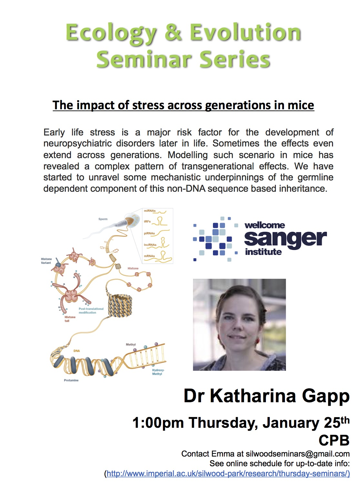

 

The impact of early chronic stress across generations in mice
- How depressed can we make mice...

The epigenome compliments the genome and controls gene expression through chemical modifications etc.

Misregulartion can result in complex diseases

__Transenerational inheritance__

- Malnutrition during grandmothers pregnancy leads to reduced birth weight of child and overweight newborn grandchild
- Eating habits of grandparents influence health and life expectancy of hrandchildren

__Early life environment shapes behaviour__

- particulary pschiatric health...
- but what about ground children?

__What about psychiatric through generations__ 

- depressed mothers have depressed children…

MSUS (maternal seperation unpredictable stress) a mouse model of aversive experiences early in life…

__Research focuses:__

Can early life stress also have advantageous effects

- impulsiveness vs goal directed behaviour?
	- Delay discounting task…
	- other experiments…
- something about hormones and receptors…
- Conclusions
	- traumatic stress in early postnatal life can provide adaptive advantage… (look at slides?)

__Does environmental enrichment prevent the transgenerational transmission….__

__Which mechanisms underlien transmission of traumatic stress__

__Overall Conclusions__

- Early life stress can have advantageous effects on offspring based on epigenetic regulation
- Environmental enrichent can prevent…

