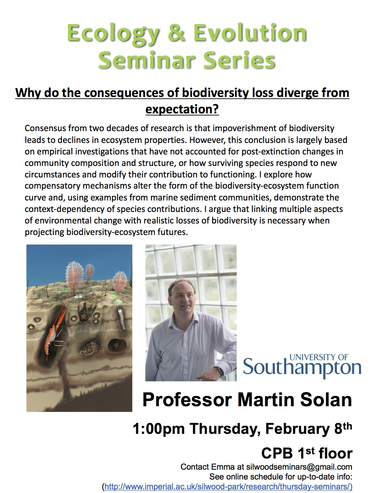

 

# Why do the consequences of biodiversity loss diverge from expectation?
__Martin Solan__

__Half a billion years ago__

- most stuff was algae grasers…
- Stuff moving into the sediment led to diversitfication of life and mixing of the sediment
- nutrient released back to the water column fueling primary productivity.

__Today ~ 30000km^2 sediment is turned over everyday!__

__Soils and sediments (are an extention of each other) and form largest habitiat on earth__

__What are the ecosystem consequences of altered biodiversity?__

- Experiments where they manipulate species richness while keeping biomass etc the same.
- Looked at effect on ecosystem function (whatever they were choosing to measure).
- Null hypothesis is that there is a 1:1 ratio – more species directly leads to more ecosystem function
- Other hypothesis
    - few key species
    - one key species
    - kinda stochastic…
    - Look on panopto for the graphs].
    - No one really knows what the shape of the curve!

- Surviving species can respond to change
    - species may increase in abundance
    - increase in biomass
    - change behaviour – functional consequences
    - change in rate of stuff… (more active)

__Successional theory…__

__Investigating species extinctions in the marine benthos__

- something about functional groups

__Bioturbation potential: linking species to ecosystem process__

- exciting looking equation
- calculate the purturbation depth after removing a bunch of different species

__Random extinction vs ordered extinctions (rarity, body size, stress sensitivity)__

- Assumptions (2 that I missed)
- loosing species by body-size is worse than random
- loosing species by rarity is less bad (probably contribution less to function)
- This shows the order of extinction does have an impact!!

__Can explore spatially what will happen at certain %s of diversity loss__

- find the breakpoint where the system colapses

__Lots of graphs for different scenarios!!__

- when species go extinct, the surviving species are not passive to that!!

__Can we observe this in real communities?__

- Mudflats only have 3-4 species
- with 3 species there are
    - 7 random extinction orders
    - 2 by body size permutations

__when you add compensation you get a different scenario… (even community)__

__some actually interesting results that I lost concentration for__

- in an even community compensatory responses is important – less so in uneven community

__How important is species dominance?__

- Increase influence of species traits
- species contributions can be population dependant and modified by biotic and abiotic setting
    - scotland vs hull vs southampton

__some stuff on higher conc of CO2/increase in temp etc..__

__Summary!__
- Saturating relationship between biodiversity and function 
- Affected by order of extinction – particulary key species functions!
- Surviving species respond to compensate (lots more work to do)
    - antagonistic, synergistic or neutral on function
    - offset some consequences of biodiversity loss
- need to look at different metrics
- when you incorperate variation you need to include more realistic ecosystem structure etc...
