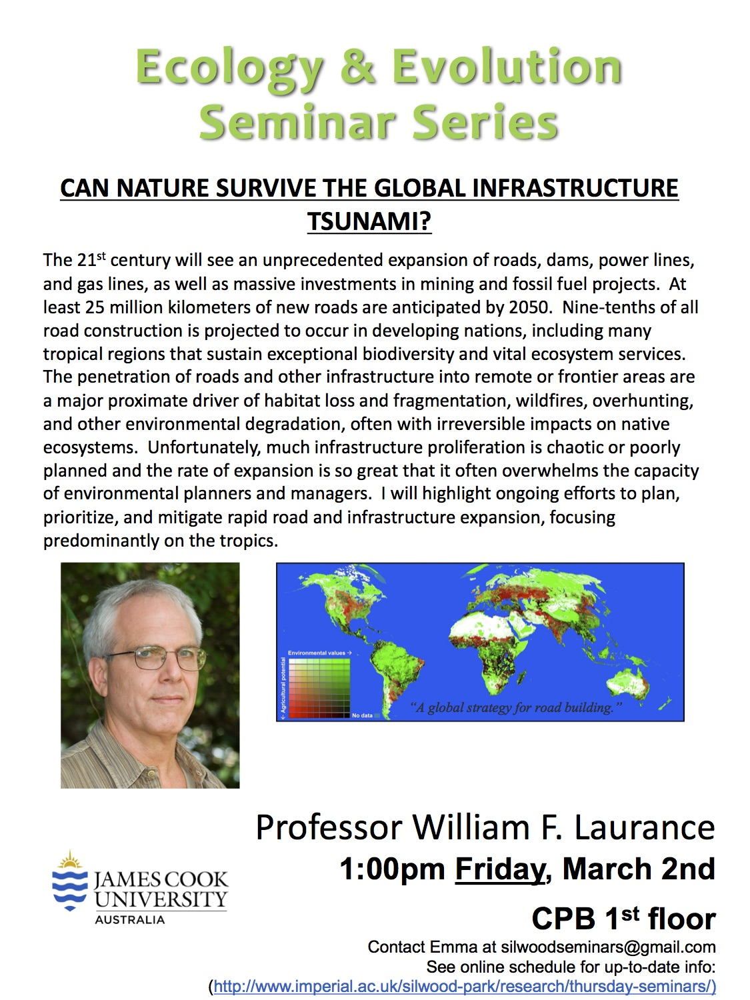

 

# Can Nature Survive the Global Infrastructure Tsunami?
__William F. Laurance__

__Goals for amount of conservation protected areas (10%, 17%, 50%?)__

__Scary Trends__

- Lots of bad shit is happening!

__Roads!!__

- big impact, you need them for all kinds of infrastructure development
- 9/10 of this happens in developing nations (not really systainable)
- Developing nations are often the most biologicaly rich/important…

__Chinas “one belt one road” initiative__

- massive infrastructure stuff! (roads, ports) to connect china to the rest of the world
- Chinese poitics is is going down hill…
    - makes it difficult to criticise the project

__Greater congo basin__

- major wilderness
- now its covered with sa fuck-ton of roads.

__Effects of roads__

- direct effects
	- habitat los//s
	- Edge effects → roads have much harsher physical climate, this bleeds into the rainforest
		- high diversity of edge effects
		- Road kill
		- some species are more vulnerable…
		- can be an important cause of population decline…
	- Barrier effects
		- some birds dont like so much light!!
		- sad bird story…
	- Corridors for invasions!
		- More mosquitos on roads than in forrest
		- Cane toads use roads… (very bad things!)
		- Fire ants like roads
- Indirect effects 
	- incursion of hunters/poachers
 	- illegal gold mining
 	- lots of sediments/mercury being produced
 	- significant impacts on local/indigenous populations --> water being poluted
 	- deforestation

__The future of the Amazon!__

- Modelling studies suggest massive increaes in forest loss/fragmentation/degredation
- Socio-economic risks
	- politicians will only do stuff if it gets them votes!

__Do frontier roads promote ‘good’ economic growth.__

- Some are broadly beneficial! - linking producers to urban markets…
	- but where these roads would go have usually already been impacted by humans, so might as well build them anyway...
	- highly variable and context dependant…

__He says roads should be prioritised to connect villages and urban areas but not really remote places. If you want a remote lifestyle then you dont get roads!!__

__increased corruption and economic disparity!__

- Roads arnt always great for the economy.
- Substantial parts of project investments goes into someones pocket!
- Air polution!!!!
- risks for water quality and stability!
- Stolen revenues → illegal logging…
- Road failure! (pot holes, slumping)
- More emphasis should be put on fewer roads!!!

__Project Collapse!__

- Investment squandared
- increased public debt
- influx of foreign money → can be bad for local economy
- cost-benefit analysis usually biased
- little public debate

__Are all projects desirable?__

- NO!

__Eco viaducts__

- only some species use them
- very expensive
- poachers use them!

__Stratigic land-use planning!__

- Make PA before road
- Try to keep PA road free
- The best way to beat cancer is to not get cancer
- Put things in a language that people will understant (i.e. this will kill n orangutangs)
