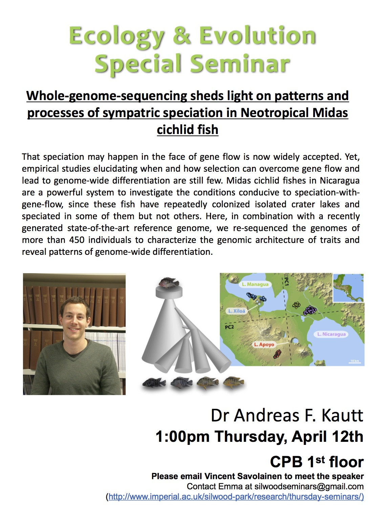

 

# Whole genome sequencing sheds light on patterns and processes of sympatric speciation in Neotropical Midas cichlid fish

__“Sympatric speciation is like the measles, everyone gets it and we all get over it"__
    
- Speciation is the build up of inherent barriers to gene flow
    - is geographic isolation required?
- Classic magic traits vs automatic magic traits?
- Cichlid fish are a great to look at speciation (1 in 30 vertebrates are cichlids)
- Looking at crater lakes – no in/outflow of water
    - Thick and fin lips…

__What is driving this divergence and when does it lead to speciation?__

1. Is the divergent selection acting on the trait?
2. Is there non-random mating?
3. What is the genetic basis of the trait?
4. How far in the speciation continuum is overall divergence?
5. How does the genomic landscape of different. Look like?	
    - They have really high quality genomes…
    - almost all lakes form mostly independent lineage

__Lippy vs non-lippy__

- Is divergent selection acting on the trait?
    - Feeding experiment on wild-caught fish.
    - Theres a tradeoff. Larger lips make it harder to get evasive fish but are better at getting into crevacises – so probably yes
- Is there non-random mating?
    - Csompletely assortative mating in the lab
    - Strong assortaative mating in the fiesl
- What is the genetic basis of the trait?
    - The did genome association studies…
- How far in the speciation continuum is overall divergence?
    - Not sure..?
- How does the genomic landscape of different. Look like?
    - Population genomic signatures around “lip locus”
- It looks like two species colonised the lakes and has begun to reverse?

__Gold vs Dark Polymorphism__

- 

__Benthic vs limnetic__
    
- Is divergent selection acting on the trait?
    - Parallel evolution argument:
    - Biomechanical argument:
    - Ecological argument:
- Is there non-random mating?
    - Yes strong assortative mating…
    - not to do with habitat isolation?
- What is the genetic basis of the trait?
- How far in the speciation continuum is overall divergence?
- How does the genomic landscape of different. Look like?
