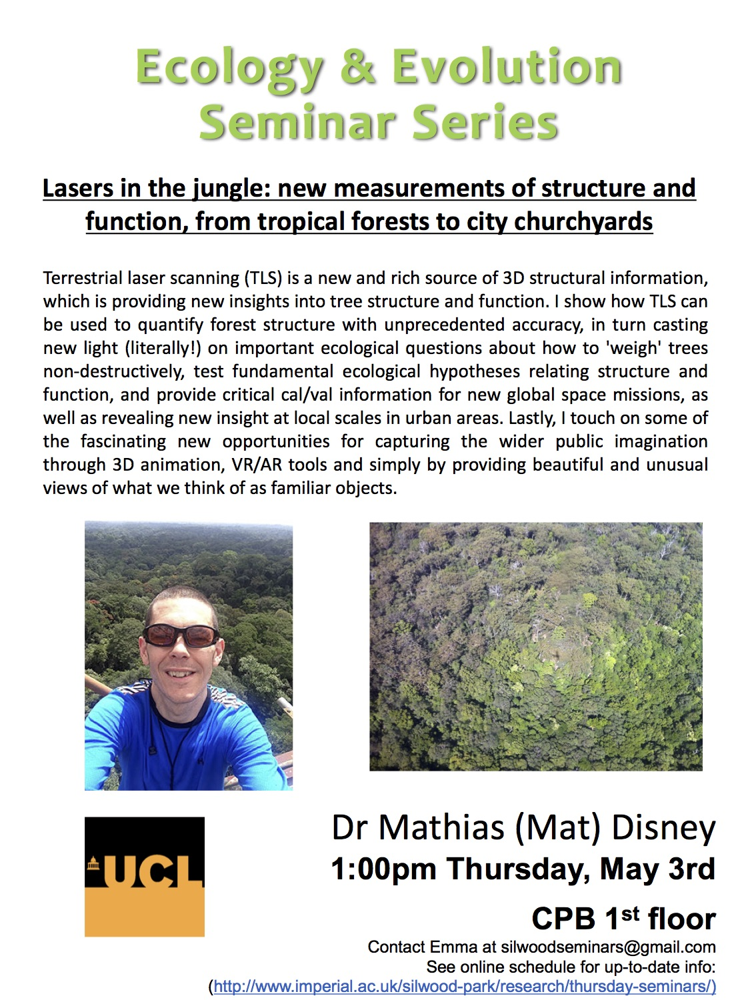

 

## Mathias Disney (UCL)
### http://disneytls.blogspot.co.uk/

TLS = Terrestrial Laser Scanning
AGB = Above Ground Biomass!

__Lidar for biomass and structure__

- terrestrial mounted tripod – camera provides colour (white where camera cant see)
 - Really impressive 3D structure of forest – example of Wytham wood

__How do we measure AGB?__

- Mostly we don’t – cause you cant get it from satellite data which is very crude and requires loads of assumptions
- Infer from indirect measurments – DHB, height (particularly EO) crown size and shape
- Then allometry (including wood density) at the tree scale and scale up!
 - Highly indirect, many uncertainties and very hard to assess

__Measuring biomass is HARD!__

- You have to cut them down and weigh them!!
- Need a team of people and it takes ages 
- what about the branches/crown of the tree?
- So all our estimates come from measurements from just a few trees!
- Dont really want to cut them down anyway

__How do we collect T__

- Global Ecosystem Dynamics Investigation (GEDI) – NASA project
	- he’s done measurements in California to calibrate the satellite
	- European equivalent mission BIOMASS (that is an acronym for something?)
		- Radar so not as good as GEDI
		- Access to p-band spectrum (which had previously been military) not allowed to do it in the places you’d expect – but can get tropics 			- Not measuring biomass – radar of something to height! Again needs calibration and assumptions.

__Greg Asner – Watch his TED talk!__

__What can TLS do for us?__

- You can get a really accurate measure of volume – just plug in wood density
- get a ‘length of branches’ measure – sycamore in Wytham wood had 11km
- What limits the height of trees?
	- Why are tropical trees not as tall as Californian redwoods?
- What about trees that are hollow!?
	- We don’t really currently deal with it?

__Turning points into trees__

- you get cluster of points from the LIDAR, need to group them to single trees
- then you can fit shapes/volumes/cylinder sets… - trace a path from bottom to tip of all branches – Tree = Network!
- Mining companies are the guys with the money!! - not really designed for ecology more for surveying!
- Do it at existing plots where we know all about the ecology – makes it easier – they provide the forest structure ecologist know the ecologist

__Site – CNRS (French Guiana)__ 

- LIDAR done in 10m grid
- looks really cool!!

__They did a scan of an Oak in Judi Dench’s back garden…__

- 12.5km of branching!!
- but its only 25m heigh…
- cylinder map looks really cool!

__Does it work?__

 - Pan-tropical allometry
 	- destructive and TLS match pretty well…

__They sample all trees – no chance of bias in choice of trees to measure!!__

- Massive difference in TLS to Chave dataset 
- small trees have a small varience in size
- Big trees can have a much larger variance in sizes (diameter)
- Height and diameter are not well correlated!!

__Back to Wytha, wood sycamore__

- previous allometry seems all wrong?
- Different protocols and choice of wood densities have massive impacts!!
- Volume is easier to go by…
- Stricture differences within and between sites…
- Opportunity to test crown shyness…. When looking up at canopy!

__Nature vs Nurture__

__Form vs Function__

Trees are networks – they transport water/nutrients/gas exchange

- analagous to other networks!
- We can start to look at what constrains tree shape/height etc.
- Metabolic scaling! - they get scaling exponants!?
- Why dont they get to their theoretical maximum!?
- Why so many branches!!

__Tree mechanics!__

- Can now look at effect of winds!
- CAD project 
- resonance

Royal society work – google it!

Trees in urban environments! - Very managed but we dont really understand how they grow!

http://disneytls.blogspot.co.uk/
https://science.nasa.gov/missions/gedi
https://pangea.stanford.edu/people/gregory-asner
https://www.ted.com/talks/greg_asner_ecology_from_the_air
https://www.bbc.co.uk/programmes/b09jxnv4

## Questions

__What about leaves?__

Not really included in AGB measurement but unlikely to make a massive difference.
Leaf litter studies exist!
In the tropics they have to do measurements with leaves on – need to strip them off…
Starting to look at leaves – one of PhDs…

__Why does his distributition not have the small trees?__

Cause we already now about the smaller trees so they didn’t bother…
The divergence is massive when it comes to bigger trees!

__Why don’t loggers have all this info already?__

Cause they are only interested in the specific good quality easy to access trees! - Very biased sample…
There data is too biased to use – all based on a reason.

__Are there differences in branching between different biomes/trees/whatever?__

Just starting to do this…
We know theres massive variation but need to explore why!
