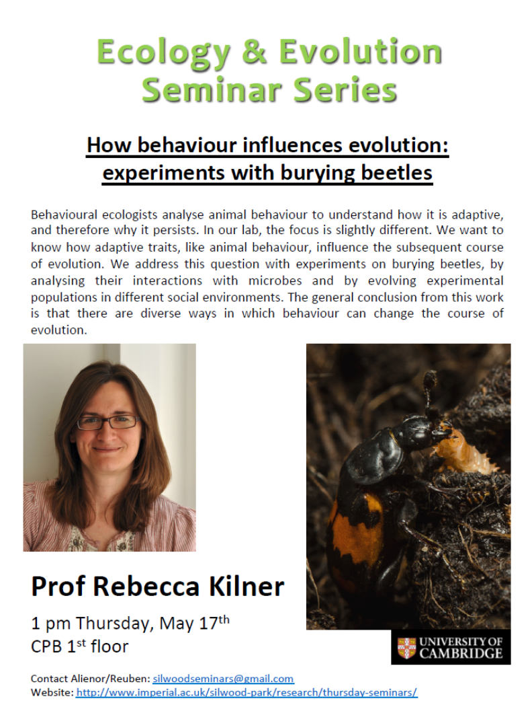

 

##How Behaviour influences evolution: experiments in burying beetles.
- Rebecca Kilner

- Burying beetle lends itself to evolution studies for a bunch of reasons…
- Each beetle gets a box
- when the want to mate the they put 2 in the same box for a week and count/measure the larvae after

- mouse decomposition
	- gut inflates then ruptures – fungi invade!
	- Beetles want to prevent this rupture and somehow compete with the microbes
		- the eat the gut whole!
		- Roll the carcass up to a nice ball of flesh…
		- covered in exudate → what kill microbes

- lysozome gene expression
	- Lys 6 expression is correlated with something…

- How do antibacterial fluids affect the bacterial community 
	- 6 replicate from 6 different field locations
	- 3 treatments
		- sample carcass – no beetles
		- sample carcass – beetles after a day (they bury the carcass)
		- sample carcass – no beetles – bury carcass after a day

- found the carcass that beetles prepared had much higher bacterial load? - weird
	- this is cause beetles seed the carcass with bacteria from their gut and what they ate from the mouses gut (relocation).

- Beetles are adapted to microbes from mouse… 

- beetles change ecological conditions – changing the structure of the bacterial environment
	- conversely the bacteria impacts the beetles success…

- Does selection by parents drive evolutionary change?
	- Experiment – no care and full care environments
	- 6 generations
	- individuals in different lines adapt to different kinds of care (no care do better in no care environment and visa versa)

	- changes in no care populations
		- feeding incision – more common in the no care line
			- when there is a cut in the carcass then more larvae survive
			- no care lines survive better – regardless of presence of cut

- no care line have developed larger mandibles

- Is there greater cooperation among no care larvae?
	- Really interesting graph
	- no care evolve to more cooperative
	- full care evolve to be more competitive (parents can compensate potential loss)

- Changes in body size across burying beetles species
	- simulating evolution with artificial selection on body size
		- a problem: adult bodysize heritability is very low…

- Full care line
	- Smaller brood → Larger larvae and larger adults…
	- So selecting larger body sizes your actually selecting for a social trait → smaller broods