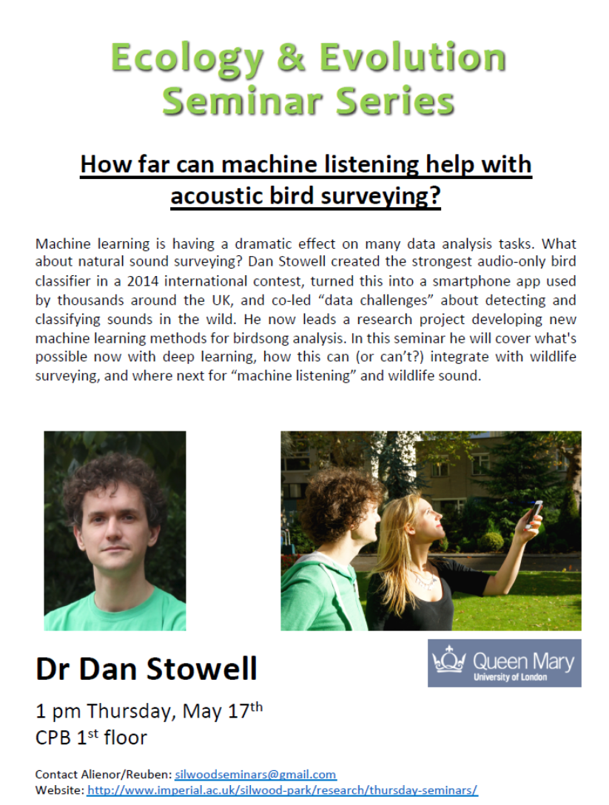

 

https://imperial.cloud.panopto.eu/Panopto/Pages/Viewer.aspx?id=9dd9a46f-553e-463e-aa01-a8ea00c63a62

##Bird calls and machine learning – Dr Dan Stowell

- postcard 1 – inferring from weak annotations…
	- figuring out where in a recording the thing is?…

- postcard 2 – bird communication networks 

###Machine listening for acoustic bird Surveying

- Species classification
	- From recording, which species is/are present
	- Useful for monitoring/research/archive management
		- only good if it works in real conditions
	- Previous research has been quite limited…
	- SABIOD project – challenge the community to combine bird classification with big data
		- BirdCLEF 2014 challenge…
		- 14000 recording, 501 species…

- Motivation
 	- Where is the information in birdsong?
 	- Traditional measures:
		- Freq range
		- Syllable duration
		- Bout duration
		- Syllable counts/sequences

- Feature choice
	- input data (slices) from spectrograms
	- templates over slices… (like neural network stuff)
		- look for matches?…

- App: Warblr
	- gives a ranked list of possibly present birds, with confidence % suggested…
	- can bootstrap recognition with ornathological society info on where to expect birds
	- got confused in Camden! - ZSL…
	- lots of recordings which dont have any birds in them!

- Detect – a missing link in the chain?
	 - Many projects need a reliable detedtion of bird sounds – long unattended recordings
 	- Detection is not the same as classification!
 	- Standard Methods
		- Energy threshold (low noise scenarios)
		- Template detection (only for highly stereotyped vocalisations)
		- HMM detection

- Bird Audio Detection Challenge!
	- Wanted algorithm to work on many different scenarios
	- used Warblr and other crowdsourced audio as training set
	- and recordings from chenobl exclusion zone as test set…
	- 30 teams submitted
	- Strong results (89% was the best)

- Ensuring that a neural network does not make use of confounding factors (that you dont want it to) is very difficult!

####Bird Audio detection 2018!!!!

###Open Questions:

- Integration with statistical Ecology
	- With machine you can give a confidence on what the thing is…
		- wheras normally it would be discrete i.e. observed/not observed
	- Distance
		- human observation would put it into quantiles…
		- not really done with machines yet (but must be possible…)
		- if you have multiple/array of microphones then you could theoretically triangulate position…

- Systematic biases etc.
	- how does detectability vary with:
		- distance
		- species
		- background noise
	- what about edge cases…
	- Lostanlen et al (2018) Proc ICASSP - https://www.researchgate.net/profile/Justin_Salamon/publication/323369757_Birdvox-full-night_A_Dataset_And_Benchmark_For_Avian_Flight_Call_Detection/links/5a909cf4aca2721405623123/Birdvox-full-night-A-Dataset-And-Benchmark-For-Avian-Flight-Call-Detection.pdf

###Perspectives

- What is ready now?
	- Usually python scripts…
	- always need anottated training sets
	- Open data and code!
		- Datasets from challenges
		- deep learning code

- Deep learning and big data are great but not sufficient.\
	- Task specific data and expertise is often needed
	- Many tasks not solvable
		- tracking development of an individual…
	- Simplifying task – so computer scientists could understand…
	- Still need to characterise the alogorithms

- Achievements so far:
	- Classification for most species (Warblr)
	- Detection for highly stereotype species
	- Rasberry pi solutions…

###Suggested reading!

- Computational Bioacoustic Scene Analysis – Stowell
	- Computational Analysis of Sound Scenes and Events (springer)
- Bird Audio Detection challenge – Under review
- Recommendations for acoustic recognizer performance assessment…
	- Knight (2017) Avian conservation and ecology