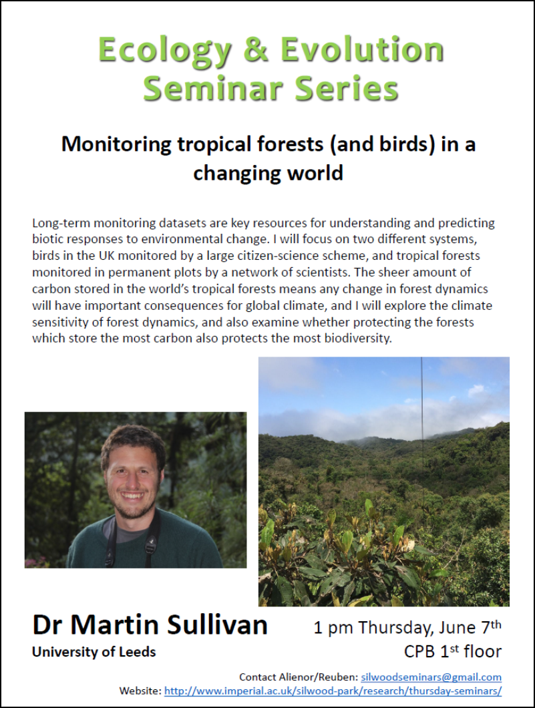

 

# Monitoring birds and tropical forest in a changing world

__what do we mean by a changing world__

- environemntal changes on different spatial scales
- and different temporal scale

__there is a long history of monitoring things__

- example of grey heron population in UK since 1964
	- Massimonna 2017?
	
__Uk breeding bird survey__

- run since 1994
- ~2800 volunteers
- \> 3500 1km squares
- primary purpose to monitor bird populations
- detect rapid declines

__why are species faring differently__

- some increaseing/some decreaseing?
- maybe something to do with their traits...
	- in terms is UK birds its bad to be a long distance migrant...
- group things by habitat

__what is the relative importance of species and habitat level processess?__

- the vast majoprity of effect is at the species level

__do trait effects operate consistantly across habitats__

- the direction of trait effects are consistant acsoss habitats
- density dependant habitat selection
	- at low pop dens birds select the best habitat
	- as pos grow they need to move into less nice habitat
	- "the buffer effect"
	- the data kina supports it...
	
__are UK bird communities experiencing biotic homogenisation?__

- Are generalists winning at the expense of specialists?
	- calc an index og species habitat specialisation 
	- average community specialisation (CSI) is decreasing (or are generalists just increasing?)
	
__rise of the super generalists__

- change in CSI reflects chnages in strong and moderate generalists

__why are specialists declining?__

- starting from a very low baseline
- tend to be doing 'ok' now as they tend to be more protected...

- environmental changes are now impacting moderate generalists too

 

#### moving to the rainforest...

- home to 50% of terrestrial biodiversity
- and a crazy amount of carbon ~180 billion tonnes

__forest inventory plots__

- typically 1 ha
- measure tree diameter at a standard height
- tag trees and resurvey...
- diameter to carbon --> using allometric equations - based on trees that have been cut down...
- something to do with getting height from the diameter

__tropical forests continue to take in carbon__

- trend towards in increasing biomass
- carbon sink!

__if we protect the most carbon dense forests do we also protect the most diversity?__

- if the relationship is positive its a win-win
- if negative then we'd have to come up with a difficult traid off...

__loads of studies show biodiversity does enhance ecosystem function and biodiverstiy__

- niche complementarity
- selection effects - just by chance you are more likely to have a species which adds to function
  
- does this rule hold true in the tropics?
	- suprisingly no!
	- there is no relationship at all!
	- Diveristy and carbon are unrelated across tropical forest biome - even after accounting for climate, soil and spatial autocorrelation.
	
 

- diversity/carbon relationship is scale dependant

__tropical forest carbon is vulnerable to extreme climate events__

- 1997/98 el nino paused the sink in Borneo

__Can we use extreme climate events to infer responses to climate change__

- talking about his masters project
	- water addition in california to simulate prolonged rainy season
	- over short times it had a (weak) positive affect
	- over longer periods the effect was significantly negative...
	- with cascading effects on higher trophic levels
	
- whats the ecological mechamism?

	- initial water addition --> nitrogen fixing --> more nitorgen --> more winter annual grassess --> more litter --> bad...

 

- species interactions may lead to complex long term respinsees
- intra specific adaption - individuals and species less sencative to line term than short term exposure
- shifts in species composition

__responses to spatial variation in claimst - a window into long term responses__

- drivers of spatial variation in forest dynamics
	- Precipitation! --> increasing time carbon remains in the system
	- max temp --> respiring lots while not photosynthesising (overnight?)
	
__how hot does it get?!__

- leaves actually get much hotter than the ambient temperature (18C hotter!)
- are there any differences in terms of how leaves thermoregulate...
	- between species...
		- Alchornea
			- limited reduction in stomatal conductance
			- reduces leaf temp
			- more water loss
		- miconia
			- reduced stomatal conductance at high thermal stress...
			- leaf gets hotter but less watre loss
	- so theres trade offs to be made...