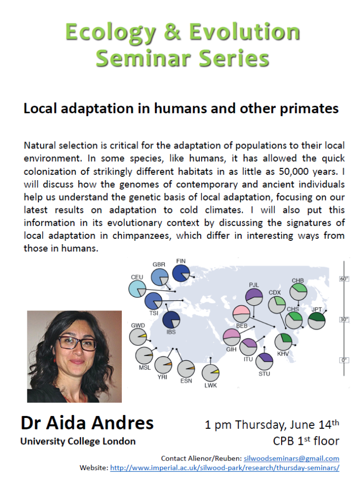

 

__Local Adaptation__

- local adaptatiosn to changes in environment or moving to new evironment
	- very quick!

__humans as an example__

- up to 50,000 years ago they only occupies Africa
- they now occupy the whole globe - includeing polar opposites of Africa, ie Serbia
- cultural but also biological

- moderate genetic diversity
- moderate poplation differentiation
	- could argue there hasnt been that much local adaptation - not much evidence for it at the genome scale
	
- example of possible anayliss 
	- compare genetics of popuilations in europe vs africa. if different allelles are fixed in the different geographys than they're probably advantageous
	- but can be explained completely without local adaptation?
		- DRIFT!

__Background selection__

- increases the effect of drift
- increase in Ne (whatever NE is)

__population differentiation__

- out of Africa bottleneck
- hard to tell which alleles fixed due to drift vs adaption (positive selection)
- to do this they need ancient genomes from out of Africa...
	- as selection occurs slower than fixation by drift than an ancient out of Africa genome will have the fixed allele freq due to drift but wont hav had time to adapt
- they've run some simulation with background selection which suggests that local adaptatation is essential to explain their findings

__there is evidence that local adaption significantly contributed to strong allele frequency population differentiation__

__Ambient Temperature__

- Africa avg is 28C _vs_ Finland with 6C
- surely adaption has occured?

- Transient Receptor Potential (TRP) ion channels - involved in thermal requlation, they change activity depending dependong on temperature (also mint)
	- genetic basis to temperature reponse has been found in mice - cold adapted mice are less fuss by cold cause TRP respond differently
- so they chose to look at this gene in humans too!
- cold adapted allele has a much higher frequency in Europe than Africa
- theres actually a nice correlation with latititude
	- they put relatedness into the model too and there is still a response (latitude + temperature) explain the relationship pretty well
	- Phylogenetic Generalised Least Squares
	- Generalised linear mixed model
- so these changes are not just Africa _vs_ Out of Africa...

__signitures of local adaption__

- models of positive selection
	- Netural (in both branches)
	- Selection on de novo (in both pops)
	- selection on standing variation (neutral in Africa but seletion out)
	
- put in a simulation
	- which simultion looks most like reality - thats the one they pick - make inferences
	
- they can also infer some things about the parameters (but very big confidence intervals)

__phenotyic associations__

- IBS and Migranes are really associated with Europeans...
- Migranes Africa<Asia<America<Europe
- studies on Caucassion and African Americans
	- higher risk for those with european ancestory...

## moving to great apes

- many are endangered
- live in fast changing environments...

__chimpanzee subspecies__

- is there evidence of local adaptation? (they havent really changed enviroment)
- much stronger evidence than there was in humans...
 - cannot explain the asymmetry without selection (local adaptation)
 - something to do with viruses and infection? rather than changes in the environment.
 