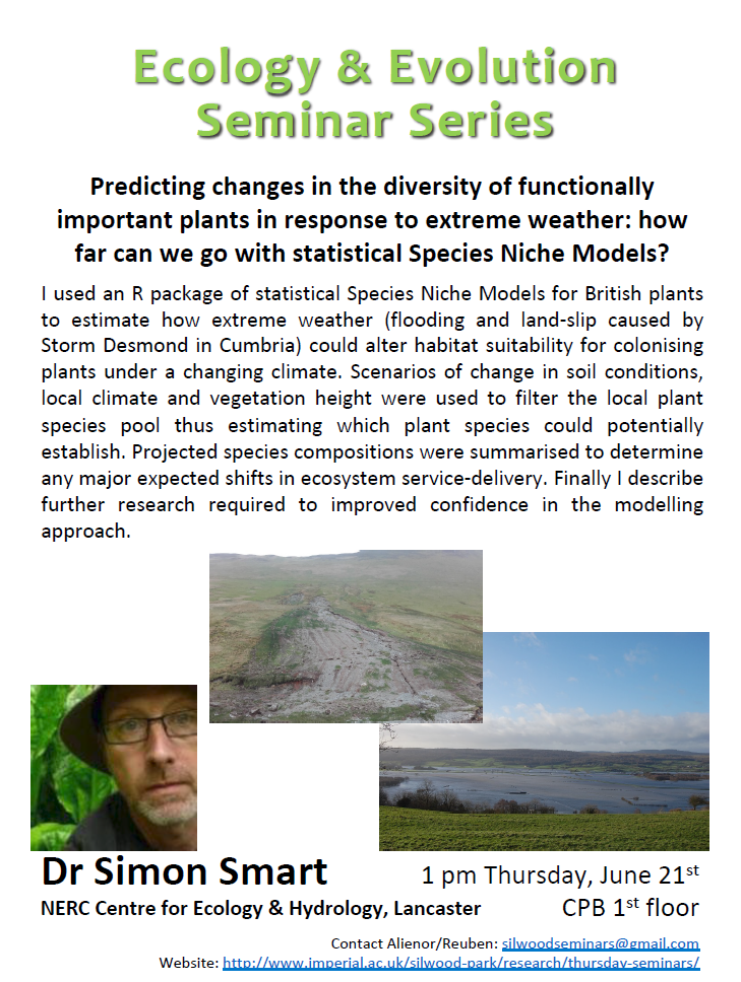

 

# Predicting changes in the diversity of functionally impoertant plants in response to extreme weather: how far can we go with statistical species Niche Models?

__how will key 'service-providing plants' respond to extreme weather events and gradual climate change__

__there are multiple drivers of global biodiversity change__
	
- Sala et al (2000) ['Global Biodiversity Scenarios for the Year 2100' ](http://science.sciencemag.org/content/287/5459/1770)

__study sites__

- looking at response to flooding... from storm Desmond!
- a) high quality agricultural land as well as valued for wildlife and recreation
- b) hill land and river valley valued to wildlife, recreation, scenic beauty, flood control and agriculture...
	- looking at land slip - threatens to expose toxic metals which get into the local streams...

__Questions__

- Science
	- will extreme weather +/- climate change result in estimated vacant niche space and therefre colonization failure?
	- Will any new potential colonists deliver a different set of services than existing vegitation.

- practical
	- Famer: Will my son be able to farm in the same way?
	NT: Will the wetland expand...
	
	
__land managment tensions are very real in the valley!__

__Statistical species niche model__

- Key axis that define where a plant lives
	- Shade/disterbance
	- substrate fertility/ph
	...
	
- R package called MultiMOVE

- the models are built on large presnce/absene datasets
- they cover 97% of CSM indicators, all nectar plants, ecosytem don=minants and loads of rarer stuff too
- each model is bacese on a weighted average of 5 modelling methods (MARS, GLM, Random Forests, GAM, Neural Networks)

__why an ensemble of methods__

- model of ombrotrophic spagnum species illustratyes the benefits of an ensemble aproach
- overfitting prompted use of cross-validation to derive model weights
- GLMM
	Robust to nuances of the species responses in covarience
- GAM
	- missed
	
- they did some model averaging...

__Application to Storm Desmond Sites: some relevant theory__

- unsaturated at path level but constrained by hectad species pool
- predict first assemble later = stacked probabiltitie = estimate of 'dark diversity'
- spescies richness estimated for various functionally relevant groups
- __nice slide__
	- Current conditions
	- Flood/land-slip
	- Flood/land-slip + CC
	- mateo et al (2017) trend in... 32
	
	

__workflow: setting up anf testing the modelled baseline in impacted sites__

- multi-scale inputs from differet providers focussed on three impacted locations in cumbria!
- MultiMOVE...
- ...

- Model testing:
	- ...
	
- modelling workflow - not really following...

__Lyth Valley (flooding)__

- forcast change in habitat stabiltiy for functionally important common plants, flooding + CC (2040-2060)

- __Summary of forcast changes in key functional groups of service providing plants__

	- negative impacts predicted for all groups except one
	- warmer, drier climate appears to buffer flooding impacts. 
	- risk of drought increases though!
	- __again a nice slide but cant really summarise in words__

__Coledale (and slip)__

- ...

__Model Criticims!__

- space does not equal tim
- no dynamic and hence no novel outcomes nore relable estimation outside the covariate range including 'no-analogue' space
- Models depict the niche of the past including th eoutcome of unknown interactions
- models depict the niche of the past and unknown interactions...
- projecting forward? ... (god he goes fast...)

__model application__

- linking dynamic and niceh models to predict the effects of climate/pollution/managment on plant biodiversity

__modelling challenege__

- we can model response groups but there may be no correlation between 'response' and 'effect'

__Cirsium arvense in upper teeside:__ 

- sugar limestone
- warmer winters
- more rabbits
- more disturbance
- more weedy generalists

- doesnt seem likey but the model predicted it and its there...

__they hired two expert botanists to check each model___

- scored each axis from excellent to poor...
- results werent great... - but interactions were not examined... - didnt necessarily present the data in a way that was easy to assess...

__extending the work...__

- model testing. its 5 years on so they can see how the models did 
- greenhouse testing to get a handle on the model climates...

__BRACE:__ Botanical Recovery After Climate Extremes